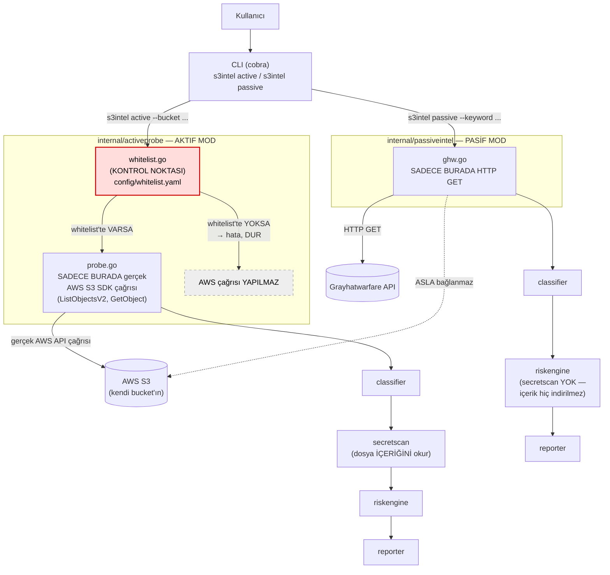

# s3intel Mimarisi

## Aktif / Pasif Ayrımı — Akış Diyagramı



## Fiziksel Ayrımın Kanıtı

Aktif ve pasif kod yolları `internal/activeprobe` ve `internal/passiveintel`
paketlerinde fiziksel olarak ayrılmıştır: `passiveintel` paketi hiçbir AWS SDK
import'u İÇERMEZ, `activeprobe` paketi hiçbir grayhatwarfare/HTTP import'u
İÇERMEZ — bu, derleme zamanında bile iki modun birbirine karışmadığının
kanıtıdır.

Bu iddia, aşağıdaki komutlarla her zaman doğrulanabilir:

```bash
# passiveintel içinde AWS SDK import'u OLMAMALI (çıktı boş olmalı)
grep -r "aws-sdk-go" internal/passiveintel/

# activeprobe içinde net/http veya grayhatwarfare import'u OLMAMALI (çıktı boş olmalı)
grep -rE "net/http|grayhatwarfare" internal/activeprobe/
```

`internal/activeprobe/whitelist.go` içindeki `IsAllowed` kontrolü,
`internal/activeprobe/probe.go` içindeki `EnumerateBucket` fonksiyonunun İLK
SATIRIDIR; kontrol ile gerçek S3 istemci çağrısı arasında başka hiçbir iş
mantığı yoktur. `internal/activeprobe/probe_test.go` içindeki
`TestEnumerateBucket_RejectsNonWhitelistedBucket` testi, whitelist'te olmayan
bir bucket için mock S3 istemcisinin HİÇ çağrılmadığını (`listCalled` /
`getCalled` bayraklarıyla) kanıtlar.

## Ortak Orkestrasyon Katmanı ve Web Arayüzü

CLI (`cmd/`) ve tarayıcı arayüzü (`internal/webui`), aynı iş mantığını
tekrarlamamak için `internal/scanjobs` adlı ortak bir orkestrasyon katmanı
üzerinden `activeprobe`/`passiveintel`'i çağırır (`scanjobs.RunActive`,
`scanjobs.RunPassive`). Bu katmanın ikisini BİRLİKTE import etmesi,
`activeprobe`/`passiveintel` arasındaki izolasyonu bozmaz: `RunActive` sadece
`activeprobe.EnumerateBucket`'ı, `RunPassive` sadece `passiveintel.Search`'ü
çağırır; ikisi hiçbir zaman aynı fonksiyon çağrısı içinde karışmaz, sadece
ayrı ayrı üretilen sonuçlar ortak `riskengine.Result` tipine dönüştürülür.

`internal/webui`, `cmd/serve.go` üzerinden `s3intel serve` komutuyla
başlatılır ve SADECE `127.0.0.1`'e bağlanır — dışarıya açık bir servis
değildir. Kendi başına ne AWS SDK ne de grayhatwarfare/HTTP-dış-çağrı mantığı
içermez; tüm veriyi `scanjobs` üzerinden alır, tek işi sonucu HTML tablo
olarak render etmektir.
