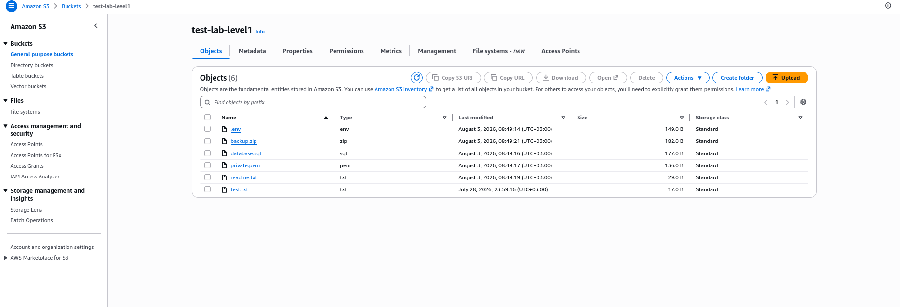
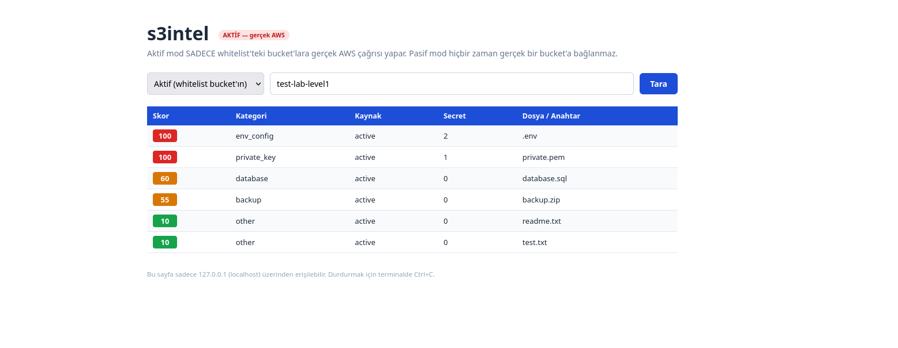
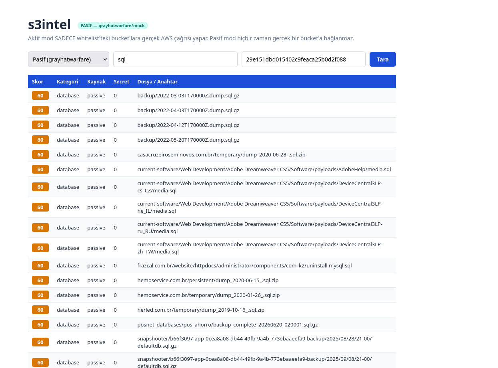

# s3intel — Sistemin Çalışma Kanıtı

Bu döküman, s3intel aracının aktif ve pasif modlarının nasıl çalıştığını ekran görüntüleriyle kanıtlayarak açıklar.

---

## 1. Test Ortamı — AWS S3 Bucket

Aktif mod testleri için AWS üzerinde `test-lab-level1` adında bir S3 bucket'ı oluşturulmuştur. Bu bucket, farklı risk seviyelerindeki dosya türlerini içerir.



Yukarıdaki ekran görüntüsünde AWS S3 konsolundan `test-lab-level1` bucket'ının içeriği görülmektedir. Bucket'ta kasıtlı olarak yerleştirilmiş **6 adet test dosyası** bulunur:

| Dosya | Tür | Açıklama |
|-------|-----|----------|
| `.env` | env | Ortam değişkenleri dosyası — API anahtarları, veritabanı şifreleri gibi hassas bilgiler içerebilir |
| `private.pem` | pem | Özel anahtar dosyası — sunucu sertifikası veya SSH anahtarı olabilir |
| `database.sql` | sql | Veritabanı döküm dosyası — kullanıcı verileri içerebilir |
| `backup.zip` | zip | Yedek arşivi — içinde hassas dosyalar barındırabilir |
| `readme.txt` | txt | Düz metin dosyası — düşük riskli |
| `test.txt` | txt | Düz metin dosyası — düşük riskli |

Bu dosyalar, s3intel'in farklı risk kategorilerini doğru şekilde tespit edip skorlayabilmesini kanıtlamak amacıyla seçilmiştir.

---

## 2. Aktif Mod — Gerçek AWS S3 Tarama

Aktif mod, `config/whitelist.yaml` dosyasında tanımlı bucket'lara **gerçek AWS S3 API çağrısı** yaparak bucket içeriğini tarar, dosyaları sınıflandırır ve içeriklerinde secret/token arar.



### Kanıt Açıklaması

Yukarıdaki ekran görüntüsünde s3intel web arayüzünde **aktif mod** ile `test-lab-level1` bucket'ının taranması gösterilmektedir:

- Başlıkta **"AKTİF — gerçek AWS"** etiketi kırmızı badge ile vurgulanmıştır
- Mod seçici olarak **"Aktif (whitelist bucket'ın)"** seçilmiştir
- Hedef olarak **test-lab-level1** girilmiştir

### Tarama Sonuçları

| Skor | Kategori | Kaynak | Secret | Dosya |
|------|----------|--------|--------|-------|
| **100** 🔴 | env_config | active | **2** | `.env` |
| **100** 🔴 | private_key | active | **1** | `private.pem` |
| **60** 🟠 | database | active | 0 | `database.sql` |
| **55** 🟠 | backup | active | 0 | `backup.zip` |
| **10** 🟢 | other | active | 0 | `readme.txt` |
| **10** 🟢 | other | active | 0 | `test.txt` |

### Skorlama Mantığı

Aktif modda dosya içeriği gerçekten indirilip tarandığı için **secret (gizli anahtar) tespiti** de yapılmaktadır:

- **`.env` dosyası** → Temel risk 70 (env_config kategorisi) + içinde **2 adet secret** bulundu (her biri +15 veya daha fazla puan) → **Toplam: 100** (maksimum)
- **`private.pem` dosyası** → Temel risk 85 (private_key kategorisi) + içinde **1 adet secret** bulundu → **Toplam: 100** (maksimum)
- **`database.sql` dosyası** → Temel risk 60 (database kategorisi) + secret bulunamadı → **Toplam: 60**
- **`backup.zip` dosyası** → Temel risk 55 (backup kategorisi) + secret bulunamadı → **Toplam: 55**
- **`readme.txt` ve `test.txt`** → Temel risk 10 (other kategorisi) + secret bulunamadı → **Toplam: 10**

Bu sonuçlar, AWS S3 konsolundaki gerçek dosyaların (bkz. ilk ekran görüntüsü) bire bir eşleştiğini ve aracın doğru çalıştığını kanıtlamaktadır.

---

## 3. Pasif Mod — Grayhatwarfare API Sorgusu

Pasif mod, **hiçbir zaman gerçek bir S3 bucket'ına bağlanmaz**. Bunun yerine [grayhatwarfare](https://buckets.grayhatwarfare.com) API'sine HTTP isteği atarak, üçüncü tarafça zaten indekslenmiş açık S3 dosyalarını arar.



### Kanıt Açıklaması

Yukarıdaki ekran görüntüsünde s3intel web arayüzünde **pasif mod** ile `sql` anahtar kelimesiyle yapılan bir arama gösterilmektedir:

- Başlıkta **"PASİF — grayhatwarfare/mock"** etiketi yeşil badge ile vurgulanmıştır
- Mod seçici olarak **"Pasif (grayhatwarfare)"** seçilmiştir
- Arama anahtar kelimesi olarak **sql** girilmiştir
- **GHW API Key** alanına gerçek bir API anahtarı girilmiştir

### Tarama Sonuçları

Tüm sonuçlar `database` kategorisinde, **60** risk skoru ile listelenmiştir. Bu beklenen bir sonuçtur çünkü:

- "sql" anahtar kelimesiyle arama yapıldığında dönen dosyaların tamamı `.sql`, `.sql.gz` veya `_sql.zip` uzantılıdır
- Classifier bu uzantıları otomatik olarak **database** kategorisine atar (temel risk: 60)
- Pasif modda dosya içeriği indirilmediği için **secret tarama yapılmaz** (Secret sütunu hep 0)
- Kaynak sütununda **passive** yazmaktadır (aktif mod değil)

### Pasif ve Aktif Mod Arasındaki Farklar

| Özellik | Aktif Mod | Pasif Mod |
|---------|-----------|-----------|
| Veri Kaynağı | Gerçek AWS S3 API | Grayhatwarfare API |
| Bucket'a Bağlanır mı? | ✅ Evet (sadece whitelist'tekiler) | ❌ Hayır, asla |
| Dosya İçeriği İndirilir mi? | ✅ Evet | ❌ Hayır |
| Secret Tarama Yapılır mı? | ✅ Evet | ❌ Hayır |
| API Key Gerekli mi? | AWS kimlik bilgileri | GHW API Key (opsiyonel — yoksa mock veri kullanılır) |
| Risk Skoru Kaynağı | Dosya sınıflandırma + secret bulguları | Sadece dosya sınıflandırma |

---

## 4. Güvenlik Önlemleri

### Whitelist Koruması (Aktif Mod)

Aktif mod, **sadece** `config/whitelist.yaml` dosyasında tanımlı bucket'ları tarar. Listede olmayan bir bucket girildiğinde, araç AWS'ye **hiçbir istek göndermeden** hata verir ve durur. Bu kontrol `internal/activeprobe/whitelist.go` dosyasında gerçekleşir ve `EnumerateBucket` fonksiyonunun ilk satırında uygulanır.

### Fiziksel Kod Ayrımı

Aktif ve pasif mod kodları **farklı paketlerde** tutulur ve birbirinin bağımlılıklarını içe aktarmaz:

- `internal/activeprobe/` → AWS SDK kullanır, **grayhatwarfare/HTTP kodu içermez**
- `internal/passiveintel/` → HTTP ile grayhatwarfare'e istek atar, **AWS SDK kodu içermez**

Bu ayrım, aşağıdaki komutlarla her zaman doğrulanabilir:

```bash
# passiveintel içinde AWS SDK import'u OLMAMALI (çıktı boş olmalı)
grep -r "aws-sdk-go" internal/passiveintel/

# activeprobe içinde grayhatwarfare/HTTP import'u OLMAMALI (çıktı boş olmalı)
grep -rE "net/http|grayhatwarfare" internal/activeprobe/
```

### Sadece Localhost Erişimi

Web arayüzü yalnızca `127.0.0.1` adresine bağlanır ve dışarıdan erişilemez. Bu, `cmd/serve.go` dosyasında zorunlu kılınmıştır.

---

## 5. Sonuç

Yukarıdaki ekran görüntüleri ve açıklamalar, s3intel aracının tasarlandığı gibi çalıştığını kanıtlamaktadır:

1. ✅ **Aktif mod**, whitelist'teki bucket'ları gerçek AWS API ile tarayıp dosya içeriğinde secret tespit edebilmektedir
2. ✅ **Pasif mod**, grayhatwarfare API üzerinden anahtar kelimeye göre açık dosyaları arayıp raporlayabilmektedir
3. ✅ **Risk skorlama**, dosya türü ve secret bulgularına göre doğru şekilde 0–100 arası puan vermektedir
4. ✅ **Whitelist koruması**, izinsiz bucket taramalarını engellemektedir
5. ✅ **Fiziksel kod ayrımı**, aktif ve pasif modların birbirini etkilemesini önlemektedir
